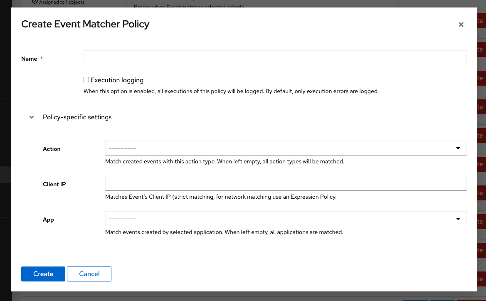

## Filtering Events

Starting with authentik 0.15, you can create notification triggers, which can alert you based on the creation of certain events.

Filtering is done by using the Policy Engine. You can do simple filtering using the "Event Matcher Policy" type.



An event has to match all configured fields, otherwise the trigger will not activate.

To match events with an "Expression Policy", you can write code like so:

```python
if "event" not in request.context:
    return False

return ip_address(request.context["evnet"].client_ip) in ip_network('192.0.2.0/24')
```

## Selecting who gets notified

After you've created the policies to match the events you want, create a "Notification Trigger".

You have to select which group the generated notification should be sent to. If left empty, the trigger will be disabled.

You also have to select which transports should be used to send the notification.
A transport with the name "default-email-transport" is created by default. This transport will use the [global email configuration](../installation/docker-compose#email-configuration-optional-but-recommended).
