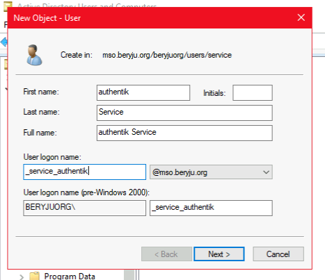
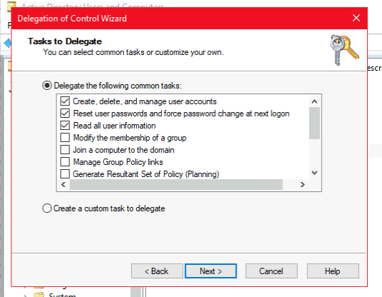
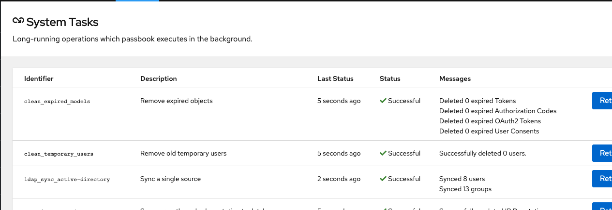

## Preparation

The following placeholders will be used:

-   `ad.company` is the Name of the Active Directory domain.
-   `authentik.company` is the FQDN of the authentik install.

## Active Directory Setup

1. Open Active Directory Users and Computers

2. Create a user in Active Directory, matching your naming scheme

    

3. Give the User a password, generated using for example `pwgen 64 1`.

4. Open the Delegation of Control Wizard by right-clicking the domain.

5. Select the authentik service user you've just created.

6. Ensure the "Reset user password and force password change at next logon" Option is checked.

    

## authentik Setup

In authentik, create a new LDAP Source in Administration -> Sources.

Use these settings:

-   Server URI: `ldap://ad.company`

    For authentik to be able to write passwords back to Active Directory, make sure to use `ldaps://`

-   Bind CN: `<name of your service user>@ad.company`
-   Bind Password: The password you've given the user above
-   Base DN: The base DN which you want authentik to sync
-   Property Mappings: Shift-Select all

The other settings might need to be adjusted based on the setup of your domain.

-   Addition User/Group DN: Additional DN which is _prepended_ to your Base DN for user synchronization.
-   Addition Group DN: Additional DN which is _prepended_ to your Base DN for group synchronization.
-   User object filter: Which objects should be considered users.
-   Group object filter: Which objects should be considered groups.
-   User group membership field: Which user field saves the group membership
-   Object uniqueness field: A user field which contains a unique Identifier
-   Sync parent group: If enabled, all synchronized groups will be given this group as a parent.

After you save the source, a synchronization will start in the background. When its done, you cen see the summary on the System Tasks page.

