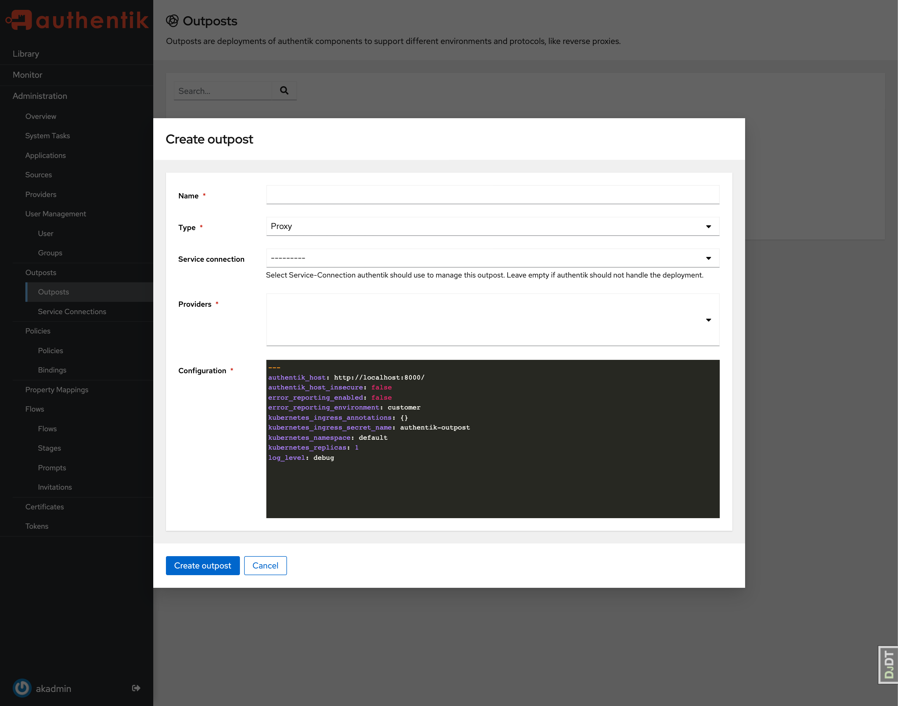

An outpost is a single deployment of a authentik component, which can be deployed in a completely separate environment. Currently, only the Proxy Provider is supported as outpost.

Upon creation, a service account and a token is generated. The service account only has permissions to read the outpost and provider configuration. This token is used by the Outpost to connect to authentik.

authentik can manage the deployment, updating and general lifecycle of an Outpost. To communicate with the underlying platforms on which the outpost is deployed, authentik has "Service Connections".

- If you've deployed authentik on docker-compose, authentik automatically create a Service Connection for the local docker socket.
- If you've deployed authentik on Kubernetes, with `kubernetesIntegration` set to true (default), authentik automatically creates a Service Connection for the local Kubernetes Cluster.

To deploy an outpost with these service connections, simply selected them during the creation of an Outpost. A background task is started, which creates the container/deployment. You can see that Status on the System Tasks page.

To deploy an outpost manually, see:

- [Kubernetes](./manual-deploy-kubernetes.md)
- [docker-compose](./manual-deploy-docker-compose.md)
